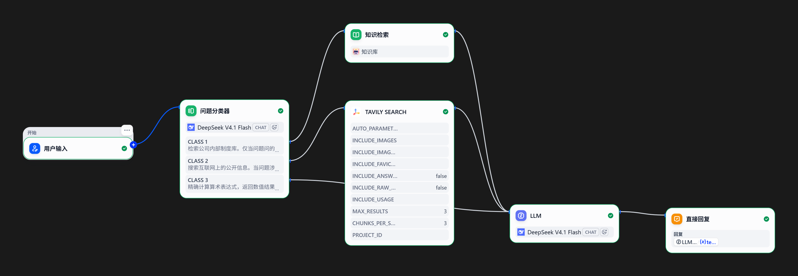

# 企业制度问答助手（关键词 → 向量 → 三工具 Agent）

员工用大白话问公司制度。系统先判断这个问题该查制度库、上网搜、还是动笔算，再基于查到的材料回答；库里没有、网上也查不到的，如实拒答不编。

## 两个版本

| 版本     | 文件                   | 检索方式                                  |
| ------ | -------------------- | ------------------------------------- |
| v1 关键词 | `rag_demo.py`        | 双字匹配（字面）                              |
| v2 向量  | `rag_demo_vector.py` | bge-m3 embedding + ChromaDB 余弦相似度（语义） |

切块、拼 prompt、调模型这三层两版逐行相同，只换了检索层——这样差异才能归因到检索上。

## 实测对比（20 题评测集）

评测集 [experiments/eval20.json](experiments/eval20.json)：直球 10 + 换说法 5 + 库外 5，先于向量版建好。每道题让检索器给 15 个块按相关度排序，表里的数字是**答案所在那一块的名次**——第 1 表示它被判为最相关；系统只取前 3 块喂给模型，第 4 名以后等于没捞到。对比由 [experiments/eval\_run.py](experiments/eval_run.py) 跑出（检索名次每次运行落盘到 experiments/eval20_ranks.json）：

| 类别      | 关键词版                  | 向量版       |
| ------- | --------------------- | --------- |
| 直球 10 题 | 答案块全部第 1              | 全部第 1     |
| 换说法 5 题 | 3 题第 1；休假题全角第 3、半角第 2 | **全部第 1** |

两个要点：

- **换说法题是分水岭**。休假题在 4 篇文档里没有"休假"两个字，关键词版只能靠"提前""申请"蹭分，名次还被一个全角逗号决定（全角第 3、半角第 2）；向量版两种标点都排第 1。
- **边界要说清**：Top-3 命中率两版都是 15/15。库只有 15 块，Top-3 太宽松，差距体现在排名，不在命中。

生成层（向量版，20 条人工全文标签）：库内 15/15 准确（口径：关键数字与结论正确，漏补充条款不算错），库外 5/5 拒答，0 幻觉。每题只跑 1 次，是单次结果。

## Agent 路由（三工具，第 16 周）

检索层再准，也只覆盖"库里有"的问题。公积金、产假这类国家有公开规定，该上网搜；年终奖、班车这类公司自主事项，网上同样查不到，只能拒答。所以在 RAG 之上加了一层 agent loop（[agent.py](agent.py)）：由模型自己路由——search_knowledge（向量库）/ web_search（tavily）/ calculate（本地四则运算），循环到能回答为止。

用 20 题路由考卷（[experiments/eval20_v1.json](experiments/eval20_v1.json)：库内 10 + 需搜索 5 + 库外 5，计数口径"按最终走向判，中途绕路不扣分"写在文件头）跑两轮对比，[experiments/eval_run_v1.py](experiments/eval_run_v1.py) 执行，逐题人工判定：

| 口径 | 改前（第一版工具描述） | 改后 |
| --- | --- | --- |
| 路由 | 17/20（库内 9/10 · 需搜索 3/5 · 库外 5/5） | **20/20**（10/10 · 5/5 · 5/5） |
| 回答质量 | 18 对 2 不全，0 错 0 编造 | 19 对 1 不全，0 错 0 编造 |

三道路由错全出在工具的"说明书"上，翻转也全靠改说明书：

- 改前的失败长一个样：题 10 该用计算器却正文心算，题 11/12 该出门搜索却在库里翻 5 次/3 次后拒答。根因在 description——search_knowledge 写的"需要根据材料回答问题时调用"什么题都能套；web_search 里"公司内部规定不在公开网页上"反而把"规定"类问题全推回库里；system prompt 的"材料里没有就直说不知道"更是在直接教模型拒答。
- 改法：description 写成判别依据（什么时候用我、什么时候别用我该找谁）；calculate 改成"回答里要出现算出的数字就一律调用，不许心算"；system prompt 改成"库里没有先判断：公开的出门搜，公司自主事项才拒答"。
- 改后零回退：库外 5 题没有因搜索放开而跑出去，库内反而 9→10。

附赠发现：改后题 11 的回答丢了开头——run_agent 原来只存模型**最后一条**消息，而这题模型把政策段落和 calculate 调用放进同一条消息，前半截文字被截掉。修复为收集各轮正文拼接后单测重采，回答完整；判定按当次采集如实记"对但不全"，缘由写进判定表备注。这次评测抓到的 bug 在采集层，不在模型。

口径：单卷单次，人工逐题判定。判定表（[改前](experiments/eval20_results_v1_改前.json) / [改后](experiments/eval20_results_v1_改后.json)）逐题带路由序列与错误方向，raw 机器稿单独归档（改前/改后各一份）。

复测（10-06，改打 HTTP 管道）：评测脚本（[experiments/eval_run_v1.py](experiments/eval_run_v1.py)，改前/改后对比也是它跑的）从旧版的"直接 import run_agent 当函数调"改为 requests.post 打 [server.py](server.py) 的 /ask，FastAPI 层从此纳入评测范围。与改后老管道对照：按考卷口径（按最终走向判）走向 20/20 一致；逐调用完全一致 9/20，差异全部来自模型随机性（同工具调用次数、绕路增减），不影响走向判定。对照限度：老文件 [eval20_results_raw_v1_改后.json](experiments/eval20_results_raw_v1_改后.json)（10-04）落盘时，工具调用记录里还没有 evidence 字段（只有工具名和参数），"记录带证据"的能力 10-05 才加进 agent。所以新旧可比的只有工具链——每题调了哪些工具、什么顺序、几次；检索命中哪一块、相似度多少、搜回什么内容，老文件没存，比不了。也因此这不是严格的 A/B：两轮之间变的不止管道（评测从"直接调函数"改成"走 HTTP"），agent 代码自己也改了。所以"走向 20/20 一致"证明的是"换了管道，走向没变形"，证明不了"两条管道行为完全等价"。结果与判定归档：[eval20_results_raw_v1_http.json](experiments/eval20_results_raw_v1_http.json)（raw）/ [eval20_results_v1_http.json](experiments/eval20_results_v1_http.json)（判定表，路由判定预核全对，回答判定人工逐题填）。判定收口：路由 20/20，回答 20 对 0 错 0 编造（12 号首句英文记语言瑕疵，内容全对；10 号留有一条 web_search 调用失败的记录——evidence 为 null——模型随后换关键词重查、第二次成功拿回 5 条结果。"失败留 None、如实溯源"是 10-05 加的机制，这是它头一回在真实评测的记录里被看到——以前只在代码审查时确认过逻辑，从没在真实运行里出现过）。

## 对照实验：Dify 复刻同款管道（10-09）

把同一条“分类→检索/搜索/计算→回答”管道在本地 Dify（Docker 自部署，模型同为 DeepSeek V4.1 Flash，知识库就传 docs/ 这 4 份，bge-m3 向量索引）里搭了一遍，量一下平台包办了什么、自己写的 agent 层还剩什么。第一版从 LLM 往两个检索节点各拉一条线，结果每个问题两路全走、制度题混进网页噪声。这次改版弄清了一件事：图上的连线本身就是路由表，不存在“模型决定走哪条”，于是换成问题分类器（公司制度/公开信息/算术三类，算术类直连 LLM），路由才算立起来。



| 手写 agent.py | Dify |
| --- | --- |
| 模型在循环里按需选工具，检索完可以接着算 | 分类器一票定路，走哪条支在分类那步锁死；病假这类“查条款+算钱”的复合题从这里分岔 |
| 路由准确率写在工具 description 里（第 16 周的翻转） | 同一条规律换个位置：病假题曾因 CLASS 2 描述列了“产假、年假等国家统一规定”被抢进搜索支，把 CLASS 1 描述改成判别依据（凡员工待遇问题一律先用本工具）后修正 |
| wrapper 把检索块拼进 prompt：检索到了不等于模型拿到了 | LLM 节点的“上下文”绑定是同一堂课：绑成用户输入时，检索明明召回了条款，模型照样说查不到 |
| calculate 本地四则运算，禁心算 | 无计算工具等位，LLM 兼任计算器，口算 |
| 查无如实拒答，建议问 HR | 同样复现 |
| evidence 条款级+相似度，进判定表可评 | 自动挂文档级引用块，不可评 |

三题冒烟（双判口径同自家判定表：路由+回答；**只有 3 题，非全量对照，不与 20/20 并列**）：病假题引条款“按基本工资的 80% 发放”并条件算出 9600，比自家考卷参考答案多指出一层，月薪不等于基本工资；班车题一句话拒答建议问 HR，零编造；算术题 24124×41%=9890.84，口算对。路由一跳的成本两边同价（分类器单次约 9.5 秒/2818 tokens）。

结论：Dify 复刻得了管道的形；评测和溯源的神还是自己那套，evidence 进判定表、路由错有方向可改，这些平台不给。什么时候直接用 Dify：内部快速搭一个不要求可控评测的知识库问答；要评测、要条款级溯源、要复合工具链，手写。Dify 侧是平台配置不是仓库代码，复现要点就是上文的配置句。

## 怎么跑

环境 Python 3.14。

```bash
pip install -r requirements.txt
```

把 `.env.example` 复制成 `.env`，填三个 key：DeepSeek（聊天）、SiliconFlow（embedding）、Tavily（搜索工具）。

```bash
python rag_demo.py                # v1 关键词版
python rag_demo_vector.py         # v2 向量版（首次运行自动建向量库 chroma_db/）
python experiments/eval_run.py    # 复现 20 题检索对比（约 20 次 embedding + 20 次对话）
python server.py                  # 起 /ask 服务（跑下面评测前先起，等 Uvicorn running 出现）
python experiments/eval_run_v1.py   # 跑 20 题路由考卷（改打 HTTP：请求经 /ask，连 FastAPI 层一起测，约几分钟）
```

改了 `docs/` 里的文档要删掉 `chroma_db/` 再跑，向量库不会自动更新。

## 安全实验

在制度文档里塞一条假规定，唯一变量是有没有编一句「经 2026 年 3 月管理层会议决议」：不编 → 0/10 中招；编了 → 9/10 中招。模型按"新规定优于旧规定"推理，每一步都对，只有前提是假的。防御要做在写入权限那一层。细节：[experiments/REPORT.md](experiments/REPORT.md)。

## 目录说明

- `docs/`：我编的 4 份公司制度（考勤/请假/报销/福利），不是真实公司文件，只作知识库素材
- `experiments/`：两代评测集（15 周检索对比 / 16 周路由考卷）、评测脚本、两轮路由判定证据、投毒复现脚本、实验报告
- `assets/`：对照实验配图（Dify 编排截图）

## 下一步

检索侧再向混合检索（关键词 + 向量两路融合）、答案带引用来源、chunk size 消融推进——还用这同一套题；最后一步公网部署拿 URL。
